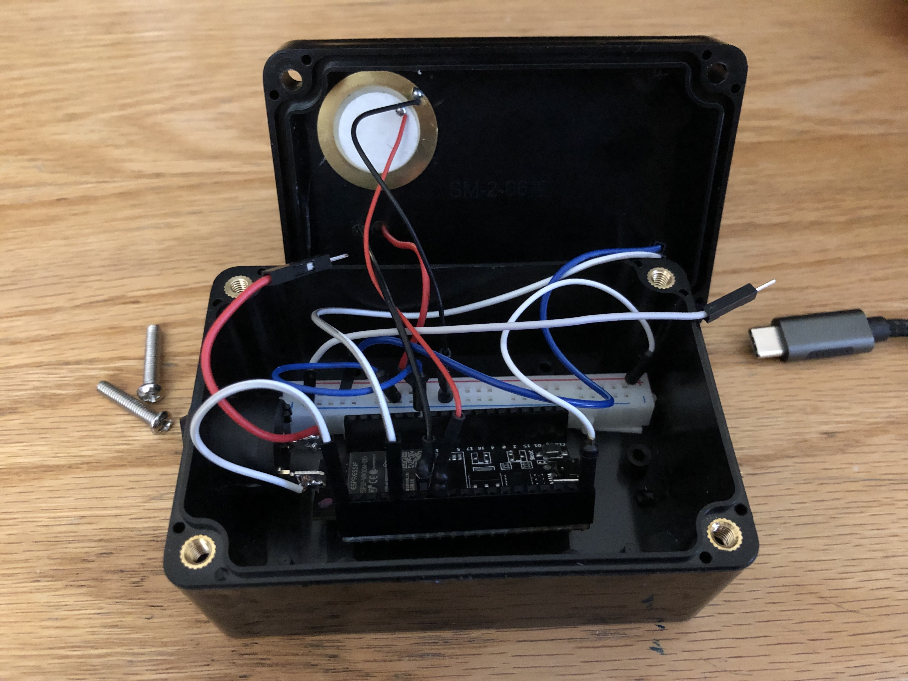

# MagicBox

## Module 3 of CPSC 334: Creative Embedded Systems

The MagicBox is a wireless system that communicates to a React Native app via UDP messages over WiFi. The system is interacted with via three sensors: piezoelectric, light, and force resist. These three methods of interation are all contained within an unassuming black box. The user can squeeze the forst resist sensor, cover the ambient light sensor, or tap different parts of the box to trigger responses from the system.

The piezoelectric sensor is mounted to the top of the project box, the light sensor and force resist sensor are mounted to the top of the box with the leads threaded through four small holes.

The MagicBox hardware:

The internals:

On the software side, the ESP32 receives analog input from each of these sensors, and with power from a 600mah LiPo battery transmits them over a WiFi network. The React Native app (when connected to the MagicBox network) provides the user with a sketch pad. Each of the box's sensors is mapped to a parameter of the drawing: the background color, the stroke weight of the pen, and the stroke color.

The slow decay of the piezoelectric sensor adds a fun and engaging effect to the stroke width, where a hard tap to the box yields a stroke width that gradually scales from heavy to light with each drawing interaction.

### Video

[On YouTube](https://youtu.be/53DOjYferYo)

### Wiring diagram for the MagicBox

